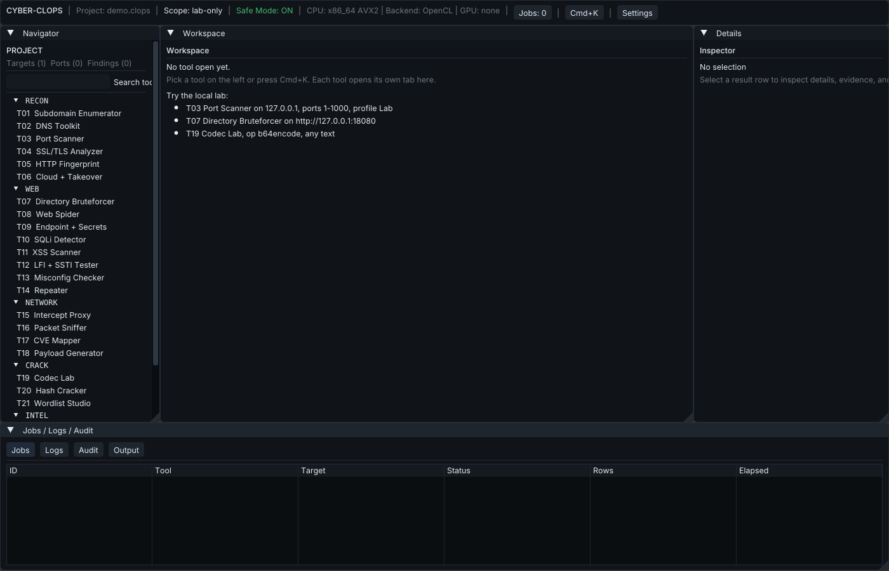

# Cyber-Clops Cyber Kit v2
Native desktop security toolkit. 25 tools, one workspace, full English UI.



## Open the GUI software

Prerequisites: CMake 3.24 plus, Ninja, Rust stable, Go 1.22 plus, X11 and GL dev headers. No sudo needed. No GPU needed.

```sh
# 1. Enter the project
cd /home/aniippxploit/Cyber-Clops

# 2. Build the engines once. Output lives in ./target inside the repo.
cargo build -p clops-core --bins
go -C workers/go build -o ../../build/clops-worker ./...

# 3. Put the engine binaries on PATH so the GUI Run buttons find them.
export PATH="$PWD/target/debug:$PATH"

# 4. Configure and build the GUI. SDL3 and ImGui fetch automatically.
cmake -S . -B ./build/dev -G Ninja \
  -DCL_OPS_BUILD_GUI=ON \
  -DSDL_X11_XSCRNSAVER=OFF \
  -DCMAKE_BUILD_TYPE=RelWithDebInfo
cmake --build ./build/dev -j

# 5. Open it. On a desktop just run the binary.
#    On a headless server wrap it with xvfb-run.
./build/dev/clops_gui
xvfb-run -a ./build/dev/clops_gui
```

First run checklist: topbar shows real CPU and backend from the accel probe, left tree lists all 25 tools in 6 groups, press Ctrl+K for the command palette, pick T03 Port Scanner, target 127.0.0.1, press Run. Open rows stream live. Stop cancels.

Troubleshooting:
- `clops-job not found` in logs: PATH in step 3 is missing. The GUI spawns it per Run.
- `CreateWindow failed` on a server: use the xvfb-run line.
- `GPU: none`: honest output. This host has no NVIDIA card, the dispatcher uses OpenCL CPU and ISPC paths.
- Layout looks stacked once: delete `./imgui.ini` and restart for the default tiled layout.

## Quick start, CPU only, no sudo needed

```sh
# Rust core tests, real localhost plus example.com polite checks
# Build output lives in ./target inside the repo
cargo test -p clops-core

# Go worker
go -C workers/go test ./...

# Native CPU tests
cmake -S . -B ./build/headless -G Ninja -DCL_OPS_BUILD_GUI=OFF
cmake --build ./build/headless -j
ctest --test-dir ./build/headless -V
```

Headless without GUI:

```sh
cmake --preset headless
cmake --build build/headless -j
ctest --test-dir build/headless -V
```

## Layout
- apps/gui: Dear ImGui SDL3 OpenGL3 shell, 25 tools, palette, live jobs
- core/rust: orchestrator, 25 engines, store, accel detect, clops-job CLI
- native: C scan and service probe, C++ dispatch and scalar bench, accel sources
- workers/go: dir brute, fuzz sniper, wordlist stream sidecar with JSON API
- scripts/lua: probes, payloads, takeover fingerprints
- tools: pcap_gen.py fixture builder, build_release.sh, hooks
- proto/clops.proto: contract for Go sidecar
- assets/wordlist: small built in lists
- tests/lab: local lab targets, real case only
- docs: ENV, JOBS, ACCEL, PERF, RELEASE

## Rules
- UI English only.
- No emdash character in code or docs. Use hyphen -.
- Safe Mode ON by default. Scope guard cannot be disabled from UI.
- GPU is optional. Topbar always shows real backend.
